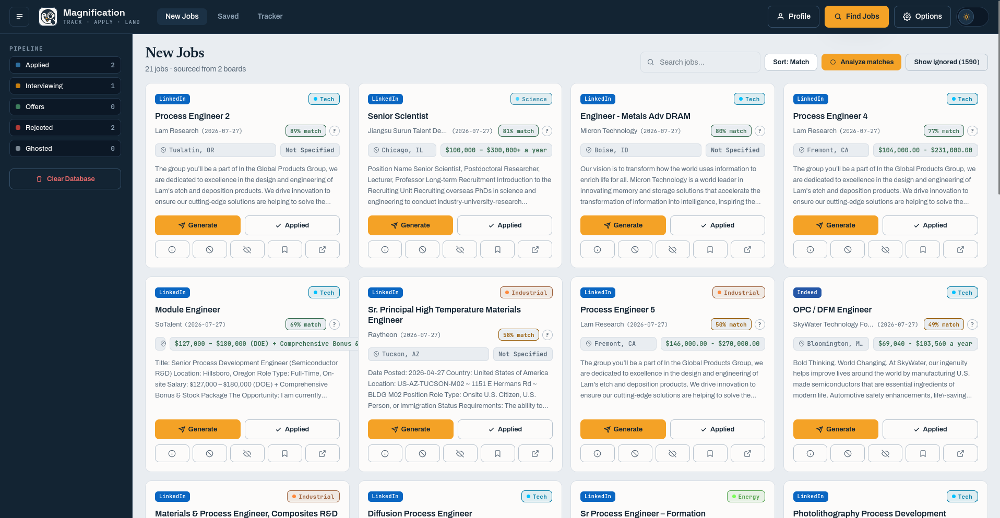
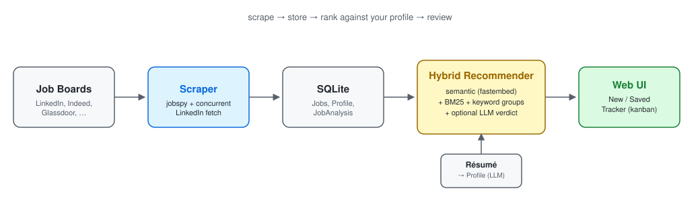
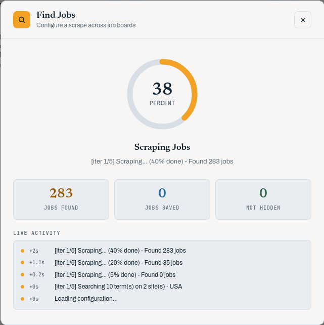
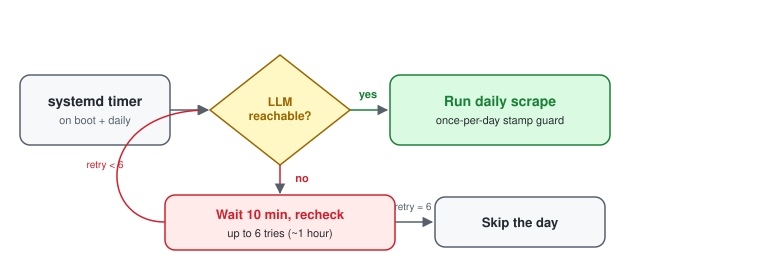

<p align="center">
  
</p>

<h1 align="center">Magnification</h1>

<p align="center"><em>Track · Apply · Land</em></p>

A local-first job-search platform: it scrapes job boards on a schedule, ranks every listing against your résumé with a hybrid RAG + LLM recommender, and gives you a Flask/React-runtime UI to review, save, and track applications through a kanban board.

No hosted demo — it's a single-user, local-first app by design (see [Setup](#setup) to run it), so here's what it looks like instead.

<p align="center">
  
</p>

<p align="center"><sub><strong>The New Jobs queue</strong> — every scraped listing scored against your résumé and sorted by match.<br>
▶ <a href="images/FullAppOverview-web.webm">Watch the 37-second walkthrough</a> (WebM, 1 MB · <a href="images/FullAppOverview-web.mp4">MP4</a>)</sub></p>

## Overview

Job searching means checking a dozen boards a day and re-reading listings you've already dismissed. Magnification automates the first half and augments the second: a scheduler pulls new listings from multiple boards (including a rate-limit-safe LinkedIn description fetch), a hybrid recommender scores each one against a profile built from your résumé, and a web UI turns the results into a working queue — new jobs, saved jobs, and an application tracker.



## Tech Stack

- **Python 3.12+** / Flask, server-rendered Jinja + a vendored React runtime (no build step)
- **SQLite** via SQLAlchemy, with idempotent migrations
- **`python-jobspy`** plus a custom concurrent scraper for multi-board, multi-country scraping
- **Hybrid recommender**: `fastembed` (bge-small-en-v1.5, CPU) semantic similarity + `rank-bm25` + keyword-group signals + an optional LLM fit verdict, combined with configurable score weights
- **`pypdf`** for résumé parsing into a structured profile
- Any OpenAI-compatible LLM endpoint (local or hosted) for profile building, job verdicts, and keyword generation
- **systemd** user units for an LLM-gated daily scrape (retries if the LLM isn't up yet, skips the day otherwise)

## Key Features

- **Hybrid job ranking** — semantic embedding + BM25 + keyword groups + an optional LLM verdict, combined with user-tunable score weights (must sum to 1.0)
- **Résumé → profile pipeline** — drag-and-drop a résumé, get a structured profile (skills, blocklists, keyword groups) an LLM can build and you can edit
- **Review workflow** — New Jobs → Save or Hide → an application-status kanban tracker, with per-company/title blocklists that retroactively hide matches
- **LLM-gated daily automation** — a systemd timer scrapes on boot and daily, checking LLM availability first (retries every 10 min for up to an hour, otherwise skips)
- **Live scraping activity feed** — step-by-step progress surfaced to the UI while a scrape runs, not just a spinner

<p align="center">
  
</p>

<p align="center"><sub>A scrape in progress — per-iteration progress and a timestamped activity log, with cumulative counters across all five iterations.</sub></p>

## Setup

```bash
uv sync          # install dependencies
uv run app.py    # start the Flask dev server → http://127.0.0.1:13374
```

Requires Python ≥ 3.12 and [`uv`](https://docs.astral.sh/uv/). `PORT` overrides the port; `FLASK_DEBUG=0` disables the dev reloader. LLM features (profile building, job verdicts, keyword generation) require an OpenAI-compatible endpoint configured in the Options panel — the app runs without one, just without those features.

For the daily-scrape systemd units, see [`deploy/systemd/`](deploy/systemd/).

## Architecture

- [`app.py`](app.py) — Flask entry point: registers blueprints, initializes the DB/logger, serves the UI
- [`utils/backend/`](utils/backend/) — API blueprints, scraping pipeline, database layer, and the LLM-gated scheduler
- [`utils/backend/recommend/`](utils/backend/recommend/) — the hybrid RAG recommender (embedder, BM25, ranker, profile builder)
- [`utils/backend/llm/`](utils/backend/llm/) — OpenAI-compatible client + endpoint config
- [`utils/frontend/`](utils/frontend/) — the Jinja/React-runtime UI (no build step)
- [`deploy/systemd/`](deploy/systemd/) — boot + daily-timer units for the LLM-gated scrape



Full breakdown: [`docs/architecture.md`](docs/architecture.md), [`docs/routes.md`](docs/routes.md), [`docs/api-contract.md`](docs/api-contract.md), [`docs/data-flow.md`](docs/data-flow.md).

## Roadmap

- [ ] Migrate web code into a `web/` layout and rebuild the frontend in React (current UI is a server-rendered/vendored-runtime hybrid)
- [ ] Add `ruff` for lint + format

## Documentation

All project documentation lives under [`docs/`](docs/) and is the single source of truth:

- [`docs/documentation.md`](docs/documentation.md) — purpose, stack, architecture, status
- [`docs/structure.md`](docs/structure.md) — repository layout
- [`docs/workflow.md`](docs/workflow.md) — commands, environment, git, docs rules
- [`docs/architecture.md`](docs/architecture.md) · [`docs/routes.md`](docs/routes.md) · [`docs/api-contract.md`](docs/api-contract.md) · [`docs/data-flow.md`](docs/data-flow.md) — web architecture
- [`docs/design-system.md`](docs/design-system.md) — visual system
- [`docs/checklist.md`](docs/checklist.md) — active and deferred work

## Agents & Skills

Agent-facing skills are canonical under [`docs/skills/`](docs/skills/). Start with
[`docs/skills/global-project-rules/SKILL.md`](docs/skills/global-project-rules/SKILL.md).
Tool pointer files live in `.claude/skills/`, `.agents/skills/` (Codex), and `.cursor/rules/`.
